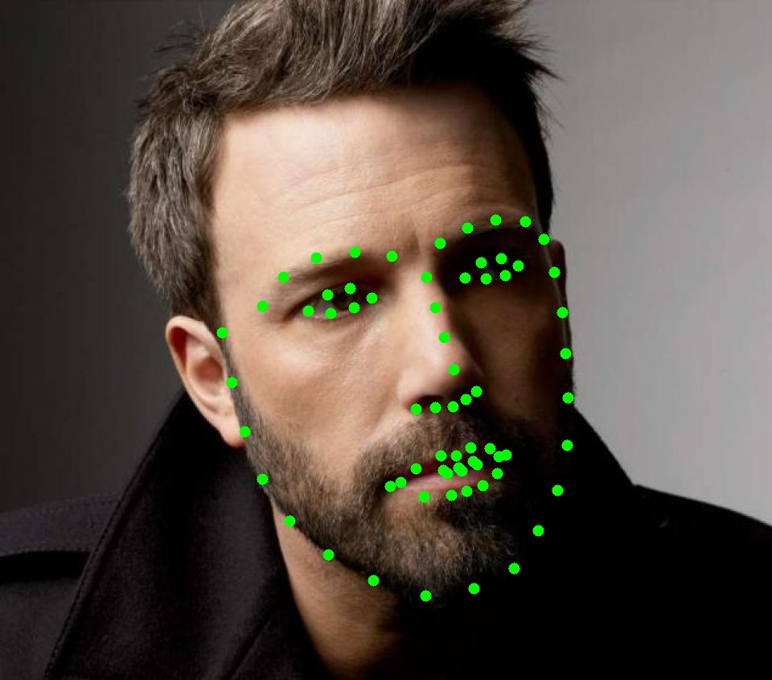

# FaceAuth

**FaceAuth** is a user authentication system based on face recognition, featuring a modern graphical interface and seamless integration with Linux systems (e.g., PAM). The application allows you to log in or authorize privileged actions (such as `sudo`) using your face instead of a typed password, or as an additional security layer.

> **Remember:**  
> FaceAuth uses 2D face recognition based on a standard webcam image. This approach is convenient and user-friendly, but it is not foolproof or as secure as advanced biometric systems (such as 3D or infrared recognition). The system may be vulnerable to sophisticated spoofing attacks (e.g., high-quality photos or videos). For critical security scenarios, always use FaceAuth as a supplement to strong passwords, not as the sole protection.


## Features

- Add and remove your own face templates (stored locally)
- Real-time face recognition for the user
- System login integration (PAM) via a custom daemon and C module
- User-friendly graphical interface (PyQt5)
- Support for multiple face templates per user

## How it works

1. **Adding a face** – The user positions their face in front of the camera and saves a template, which is processed by dlib models and stored as a feature vector.
2. **Recognition** – During login, the application compares the current camera image with saved templates.
3. **PAM integration** – The C module communicates with the daemon, which performs face recognition and returns the result to the system.

## Technologies used

- **Python 3** – main application language
- **PyQt5** – graphical user interface
- **OpenCV** – camera handling and image processing
- **dlib** – face detection, landmark extraction, and feature vector generation
- **NumPy** – numerical operations and feature vector handling
- **PAM (Pluggable Authentication Modules)** – Linux login integration (optional)
- **C** – intermediary module for PAM

## Models used

- `68_face_landmarks_model_v2.dat` – custom-trained dlib model for detecting 68 facial landmarks, required for proper feature extraction.
- `dlib_face_recognition_resnet_model_v1.dat` – dlib model based on ResNet, generating a unique face feature vector for comparison and recognition.

## Requirements

- Python 3.7+
- dlib
- OpenCV
- PyQt5
- NumPy
- PAM (optional, for system integration)

## Installation

1. Install the required libraries:
    ```bash
    pip install -r requirements.txt
    ```
    If you don't have a `requirements.txt` file, you can install the main dependencies manually:
    ```bash
    pip install dlib opencv-python PyQt5 numpy
    ```
2. Make sure the dlib models are present in the project directory:
    - `68_face_landmarks_model_v2.dat`
    - `dlib_face_recognition_resnet_model_v1.dat`

3. **Create your face template(s):**
    - Run the main application to add your face:
        ```bash
        python3 main.py
        ```
    - Use the GUI to add and save your face template(s). These will be stored locally for your user.

4. **Set up the PAM daemon:**
    - Add `pam-module-deamon.py` to autostart (e.g., as a systemd service or a background process at login), so it runs in the background and listens for authentication requests.

5. **Configure PAM:**
    - Edit the PAM configuration file for the service you want to protect, for example for `sudo`:
        ```bash
        sudo nano /etc/pam.d/sudo
        ```
    - Add the following line at the top:
        ```
        auth sufficient pam_exec.so stdout /path/to/face-auth/face-auth
        ```
      Replace `/path/to/face-auth` with the path to your compiled C module that communicates with the daemon.

6. **(Optional) Compile the C module:**
    - If you use the provided C intermediary for PAM:
        ```bash
        gcc -o face-auth face_auth.c
        ```

## License

Project released under the MIT license.